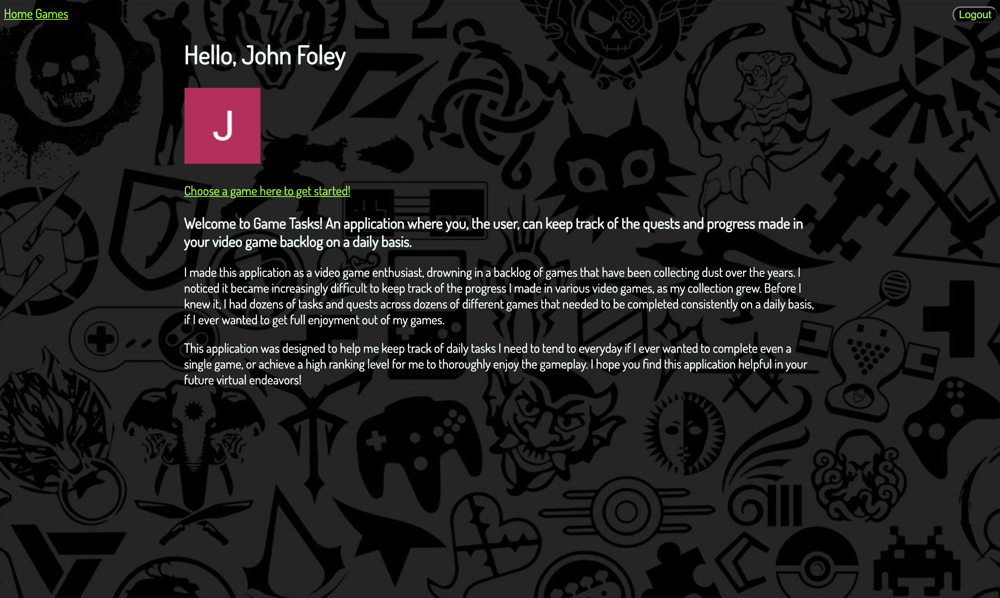

# Game Tasks

Hello and welcome to my application titled Game Tasks! The app that lets you keep track of the numerous quests and objectives that accumulate in video games!

### Getting started

Click [here](https://gamingtasks141.herokuapp.com/) to start the application. You must sign in with a google account.

Trello board can be found [here](https://trello.com/b/9UfZxO7H/gaming-tasklist)

### Tachnologies used:

- JavaScript
- ejs
- dotenv
- CSS
- HTML
- Git
- Express
- Google Oauth 2.0
- Mongoose
- MongoDb
- method-override
- passport.js

## Future changes

- Be able to search for games using an API
- Day tracker so you can see past checklists without clogging up the page
- Mobile friendly